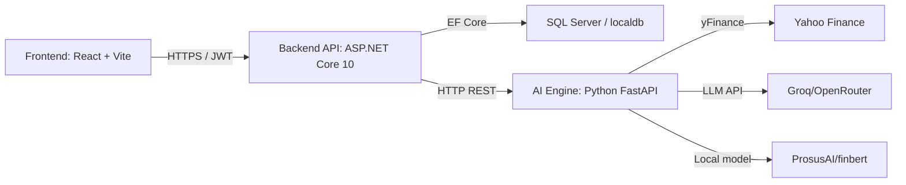

# StockMindAI Full Project Flow

## 1. Project Purpose
StockMindAI is a full-stack financial intelligence platform that combines:
- A React-based trading terminal dashboard
- An ASP.NET Core backend API gateway
- A Python FastAPI AI engine for technical analysis, forecasting, sentiment, and chat advisory
- A persistent SQL database for users, portfolios, watchlists, alerts, and chat history

## 2. Architecture Overview

## 3. Main Technology Stack

### Frontend
- React 19
- Vite
- Chart.js + react-chartjs-2
- Axios for HTTP requests
- Lucide Icons
- CSS-based dashboard styling

### Backend API
- ASP.NET Core 10 Web API
- Entity Framework Core (EF Core)
- SQL Server provider / localdb
- JWT Bearer authentication
- Swagger for API documentation

### AI Engine
- Python FastAPI
- pandas, NumPy
- yfinance
- requests
- python-dotenv
- Optional HuggingFace Transformers / torch for FinBERT

### Models & Services
- `FinBERTModel` for news sentiment analysis
- `LSTMPredictor` for 7-day stock price forecasts
- `RecommendationEngine` for BUY/HOLD/SELL signals
- `RiskEngine` for portfolio risk diagnostics and advice
- `AIChatbot` for conversational market advisory

## 4. Full Data Flow

1. User interacts with the React frontend.
2. Frontend sends requests to the ASP.NET backend using JWT tokens.
3. Backend serves user/auth, watchlist, portfolio, stock, news, and AI endpoints.
4. Backend routes AI-related requests to the Python FastAPI engine.
5. Python AI engine fetches stock history with `yfinance` and performs:
   - Technical indicator calculation
   - Sentiment analysis
   - Prediction / forecasting
   - Recommendation synthesis
   - Chat advisory prompt generation
6. AI engine returns structured JSON to backend.
7. Backend sends the result back to the frontend.
8. Frontend updates UI cards, charts, advisor chat, and portfolio summaries.

## 5. API Endpoints Used

### Frontend -> Backend
- `POST /api/auth/login`
- `POST /api/auth/register`
- `GET /api/auth/profile`
- `PUT /api/auth/profile`
- `GET /api/stock/search`
- `GET /api/stock/details?symbol=...`
- `GET /api/stock/watchlist`
- `POST /api/stock/watchlist/{symbol}`
- `DELETE /api/stock/watchlist/{symbol}`
- `GET /api/stock/alerts`
- `POST /api/stock/alerts/read`
- `GET /api/portfolio`
- `POST /api/portfolio`
- `DELETE /api/portfolio/{id}`
- `GET /api/portfolio/risk`
- `POST /api/portfolio/upload`
- `POST /api/portfolio/broker/sync`
- `POST /api/ai/chat`
- `GET /api/ai/chat/history`
- `POST /api/ai/chat/clear`
- `GET /api/ai/predict?symbol=...`
- `GET /api/ai/recommend?symbol=...`
- `GET /api/ai/market-summary`

### Backend -> AI Engine
- `POST /api/chat`
- `POST /api/analyze/technical`
- `POST /api/analyze/sentiment`
- `POST /api/predict`
- `POST /api/recommend`
- `POST /api/portfolio/risk`
- `GET /api/stock/search`
- `GET /api/market/summary`

### External / Third-Party APIs
- Yahoo Finance through `yfinance` and direct search via `https://query2.finance.yahoo.com/v1/finance/search`
- Groq / OpenRouter chat completions for LLM-backed advisory and sentiment fallback
- Local HuggingFace FinBERT model if `transformers` and `torch` are installed

## 6. Key Libraries and Packages

### Python (`requirements.txt`)
- fastapi
- uvicorn
- yfinance
- pandas
- numpy
- requests
- python-dotenv

### Backend (`backend-dotnet/StockMindAI.API.csproj`)
- Microsoft.AspNetCore.Authentication.JwtBearer
- Microsoft.EntityFrameworkCore.Design
- Microsoft.EntityFrameworkCore.SqlServer
- Microsoft.EntityFrameworkCore.Tools
- Swashbuckle.AspNetCore
- System.IdentityModel.Tokens.Jwt

### Frontend (`frontend-react/package.json`)
- react
- react-dom
- axios
- lucide-react
- chart.js
- react-chartjs-2
- @vitejs/plugin-react
- eslint
- vite

## 7. Important Project Directories

- `frontend-react/` — React SPA, pages, components, services
- `backend-dotnet/` — ASP.NET Core Web API project and controllers
- `ai-engine-python/` — Python FastAPI AI engine, models, and services
- `database/` — schema files and SQL definitions
- `models/` and `services/` — shared Python ML/service logic in root
- `utils/` — environment keys and helper utilities

## 8. Runtime and Deployment Notes

- Backend expects `AIEngineSettings:BaseUrl` in configuration, defaulting to `http://127.0.0.1:8000`.
- Python AI engine uses `uvicorn main:app --host 127.0.0.1 --port 8000`.
- Frontend is expected to run with `npm run dev` from `frontend-react/`.
- Backend runs with `dotnet run` in `backend-dotnet/` after restore.
- Local SQL Server / localdb is used by the backend, and EF Core auto-creates tables at startup.

## 9. What the AI Engine Computes

- Technical indicators: RSI, MACD, SMA/EMA, Bollinger Bands, and derived signals
- Price forecasts: 7-day predicted prices and growth/risk probabilities
- Sentiment classification: FinBERT local analysis or LLM fallback
- Recommendation: combined signal from technicals, sentiment, and prediction
- Portfolio risk: analysis and advisory text based on holdings and risk appetite
- Chat advisory: enriched prompt generation, history-aware advisor responses

## 10. Summary of What You Use

- `React + Vite` for the user dashboard
- `ASP.NET Core 10` for API gateway, auth, persistence, and orchestration
- `EF Core + SQL Server` for user, portfolio, watchlist, and chat history storage
- `Python FastAPI` for analysis engine
- `yfinance` for market data
- `FinBERT / Groq / OpenRouter` for sentiment and AI advisory
- `LSTM-style forecasting` for short-term prediction
- `JWT` for secure user sessions
- `Swagger` for backend API documentation

---

> This file gives the complete end-to-end architecture, the technologies used, the APIs wired across the stack, and the key services powering StockMindAI.
