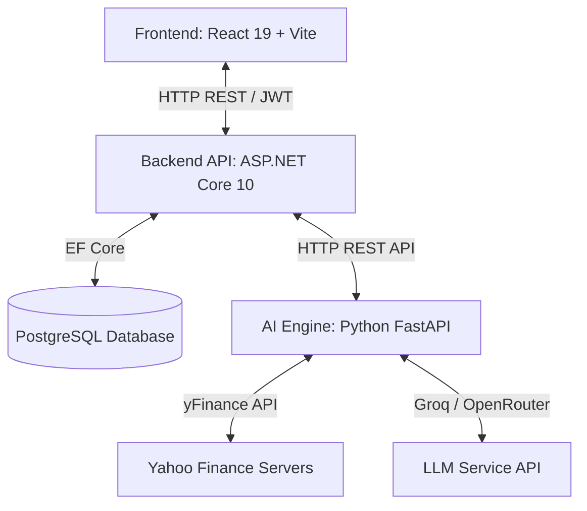

<<<<<<< HEAD
# StockMindAI: AI-Powered Stock Market Intelligence Platform

**StockMindAI** is a premium, full-scale financial intelligence platform engineered to simulate a professional trading desk environment (e.g., Bloomberg Terminal and TradingView). The system combines deep statistical indicators, FinBERT neural network news sentiment, Monte Carlo price forecasting models, active alert triggers, and an augmented RAG conversational financial advisor.

---

## 🏗️ System Architecture & Stack

The platform is designed with a decoupled three-tier microservice architecture:



### 1. **Frontend (Terminal Shell)**
- **Tech**: React 19, Vite, Tailwind CSS, Lucide Icons, and HTML5 Canvas.
- **Features**: High-fidelity dark space-theme dashboard, real-time custom candle indicators, responsive glassmorphic cards, alerts feeds, portfolio CSV imports, and interactive terminal chat advisor consoles.

### 2. **Backend API (System Gateway)**
- **Tech**: ASP.NET Core Web API (.NET 10), Entity Framework Core (EF Core), JWT Bearer Security.
- **Features**: Custom SHA-256 password hashing, user registration, JWT emission, stock history local caches, watchlist management, transaction logging, CSV stream parsing, and API gateway routing.

### 3. **AI Engine (Statistical & Cognitive Center)**
- **Tech**: Python FastAPI, pandas, NumPy, yFinance, HuggingFace Transformers (FinBERT).
- **Features**: 
  - **Technical Indicators**: RSI (14), MACD (12, 26, 9), SMA/EMA (50, 200), and Bollinger Bands (20-day, 2-std).
  - **Price Predictor**: Ensemble time-series regressions + linear drift + Monte Carlo random walks (1,000 iterations) to output statistical Growth and Risk probabilities.
  - **Movers & Heatmaps**: sector heatmaps and daily movers tracking.
  - **News Classifier**: FinBERT news sentiment parsing with dual-layer LLM fallback routines via Groq/OpenRouter.
  - **Advisory Chat**: Context-aware prompt RAG conversational system injecting active watchlists, technical charts, news blocks, and risk profiles.

---

## 📂 Project Directory Structure

```text
StockMindAI/
├── frontend-react/        # React + Vite + Tailwind CSS dashboard
├── backend-dotnet/        # ASP.NET Core Web API (.NET 10 solution)
├── ai-engine-python/      # FastAPI + yFinance + news + LLM services
├── database/              # PostgreSQL schema definitions and seeds
├── docs/                  # Architectural documentations
└── README.md              # Main project documentation (this file)
```

---

## 🛠️ Quick Start & Launch Guide

### Prerequisites
- Node.js (v18+)
- .NET SDK (v10.0+)
- Python (v3.10+) with `pip`
- PostgreSQL (running locally or supabased)
- API Keys stored in `Apikeys.txt` at root folder

### 1. Database Setup
Ensure PostgreSQL is running and update the connection string inside `backend-dotnet/appsettings.json`. Apply schemas:
```bash
# Using the schema script
psql -U postgres -d stockmindai -f database/schema.sql
```
*(Note: ASP.NET Core is configured with EF Core `.EnsureCreated()`, meaning tables will auto-synchronize on your first backend launch).*

### 2. Run Python AI Engine
```bash
cd ai-engine-python
pip install -r requirements.txt
uvicorn main:app --host 127.0.0.1 --port 8000 --reload
```
Exposes FastAPI REST endpoints on `https://stockmindai-backend.onrender.com`.

### 3. Run Backend API Gateway
```bash
cd backend-dotnet
dotnet restore
dotnet run
```
Exposes Web API REST endpoints on `https://stockmindai-backend.onrender.com`.

### 4. Run React Frontend Terminal
```bash
cd frontend-react
npm install
npm run dev
```
Serves the React dashboard SPA on `https://stock-mind-ai-front-end.vercel.app`.

---

## 📊 Core Features

1. **User Auth & Profiles**: Custom authentication, secure local storage session tokens, dynamic profile customizer for risk profiles.
2. **Interactive Charting**: Canvas candlestick chart plotting 50/200 SMA, Bollinger Bands, and real-time hover coordinate coordinates tracking.
3. **Consensus Recommendation**: Combination technical rating, news sentiment weight, and forecasting drift delivering BUY/HOLD/SELL suggestions.
4. **Portfolio Diagnostics**: CSV spreadsheet upload engine dynamically calculating weighted beta volatility and sector-diversification exposure.
5. **AI Advisor Console**: Analyst chatbot terminal that maintains conversational states.

---

## 🔒 License & Disclaimer
This platform is a financial intelligence and education dashboard simulator. All analytical consensus ratings and Monte Carlo predictions represent statistical calculations and do not constitute certified investment advice.
=======
# StockMindAI
Stick Market AI
>>>>>>> a3821b10e1094deb956d797f476845fbb11530b9
